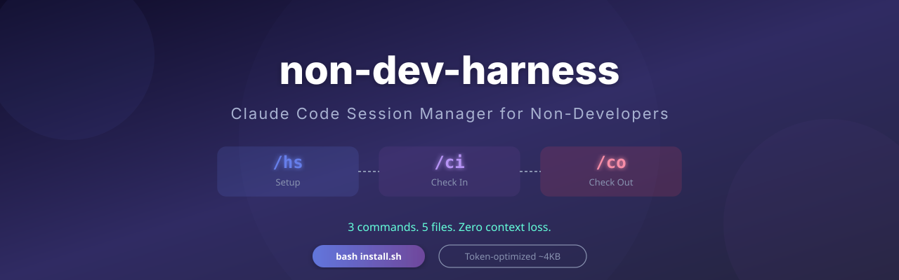
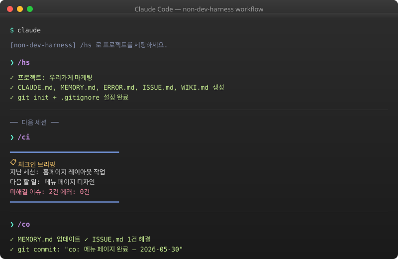
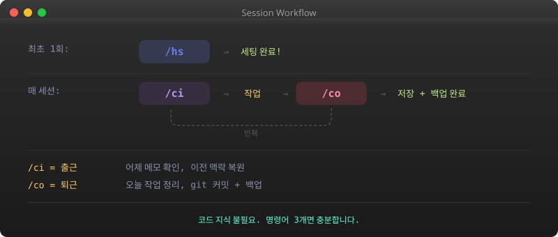
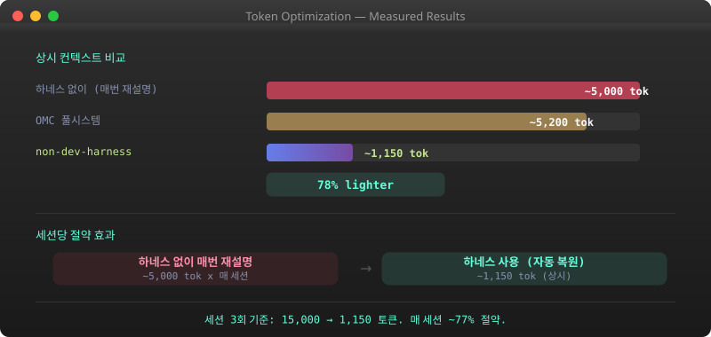
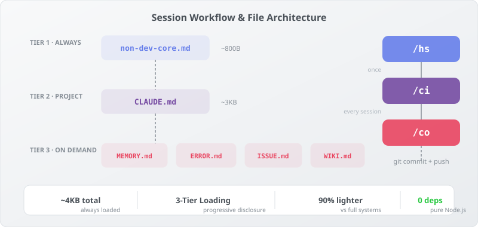

<p align="center">
  
</p>

<p align="center">
  <a href="https://github.com/calmtiger86/non-dev-harness/blob/main/LICENSE"></a>
  
  
  
  
  
</p>

<p align="center">
  <b>비개발자를 위한 Claude Code 세션 관리 플러그인</b><br>
  <sub>명령어 3개로 어제 작업을 이어갑니다. 코딩 몰라도 됩니다.</sub>
</p>

<p align="center">
  <b>한국어</b> · 
  <a href="./README.en.md">English</a>
</p>

<p align="center">
  <a href="#-설치">설치</a> · 
  <a href="#-사용법">사용법</a> · 
  <a href="#-워크플로우">워크플로우</a> · 
  <a href="#-토큰-절약">토큰 절약</a> · 
  <a href="#-제거">제거</a>
</p>

---

## 왜 필요한가요?

Claude Code를 쓰다 보면 이런 상황이 반복됩니다.

세션이 끊기고, 다시 열면 Claude는 아무것도 모릅니다. 어제 세 시간 동안 같이 작업한 내용도, "이건 이렇게 하기로 했잖아"라는 맥락도 전부 사라져 있습니다. 결국 매번 처음부터 다시 설명하게 됩니다.

에러가 나면 더 답답합니다. 분명 지난번에도 같은 문제가 있었는데, Claude는 기억 못 하니까 또 같은 삽질을 합니다. 해결했던 방법도 어딘가에 적어두지 않으면 그냥 날아갑니다.

작업이 끝나면 커밋하고 푸시해야 하는데, 그걸 깜빡하는 날이면 다음에 열었을 때 "어디까지 했더라?"부터 시작입니다.

**non-dev-harness는 이 루틴을 명령어 3개로 만들었습니다.** `/ci`로 지난 맥락을 복원하고, 작업하고, `/co`로 정리하면 끝. 다음 세션에서 `/ci`를 치면 어제 어디까지 했는지 알아서 알려줍니다.

---

## 📦 설치

### macOS / Linux

```bash
git clone https://github.com/calmtiger86/non-dev-harness.git
cd non-dev-harness
bash install.sh
```

### Windows

```powershell
git clone https://github.com/calmtiger86/non-dev-harness.git
cd non-dev-harness
powershell -File install.ps1
```

> 설치 후 Claude Code를 **재시작**하세요.

<details>
<summary><b>설치하면 뭐가 생기나요?</b></summary>

```
~/.claude/
├── plugins/non-dev-harness/   ← 플러그인 본체
├── skills/hs/, ci/, co/       ← 명령어 3개
├── rules/common/non-dev-core.md ← 기본 규칙 (~800B)
└── settings.json              ← 세션 시작 훅 등록
```

- 설치 중간에 실패하면 만든 파일을 자동으로 지움
- 이미 같은 이름의 스킬이 있으면 건드리지 않음
- settings.json은 임시 파일로 먼저 쓰고 교체 (중간에 꺼져도 안 깨짐)

</details>

---

## 🚀 사용법

<p align="center">
  
</p>

### `/hs` — **H**arness **S**etup

새 프로젝트에서 처음 한 번만 실행합니다.

```
❯ /hs
```

- 프로젝트에 대해 몇 가지 물어봄 (이름, 목적, 대상)
- 컨텍스트 파일 5개 생성
- Git 초기화 + `.gitignore` 설정
- 프로젝트에 맞는 규칙 세팅

### `/ci` — **C**heck **I**n (출근)

세션 시작할 때 가장 먼저 칩니다.

```
❯ /ci
```

- 지난 작업 내역 확인하고 요약 보고
- 아직 안 끝난 이슈나 에러 알려줌
- 다음에 뭘 해야 하는지 안내
- 같은 에러가 자꾸 나오면 경고

### `/co` — **C**heck **O**ut (퇴근)

세션 끝낼 때 실행합니다.

```
❯ /co
```

- 오늘 한 일을 파일 5개에 나눠서 정리
- 다음에 할 일 목록 작성
- 비밀번호·키 파일이 올라가지 않게 차단
- Git 커밋 + 원격 저장소 백업

---

## 📁 생성되는 파일

| 파일 | 비유 | 역할 |
|------|------|------|
| **CLAUDE.md** | 사무실 게시판 | 프로젝트 규칙. 매 세션마다 자동으로 읽힘 |
| **MEMORY.md** | 업무 일지 | 세션 이력, 의사결정, TODO. 최근 5개 유지 |
| **ERROR.md** | 문제 해결 노트 | 에러가 났을 때 어떻게 고쳤는지 기록 |
| **ISSUE.md** | 할 일 목록 | 아직 안 끝난 이슈와 버그. 우선순위 3단계 |
| **WIKI.md** | 백과사전 | 프로젝트 영구 지식. 카테고리별 정리 |

---

## 🔄 워크플로우

<p align="center">
  
</p>

---

## ⚡ 토큰 절약

<p align="center">
  
</p>

Claude Code는 세션을 시작할 때마다 규칙과 맥락 파일을 읽습니다. 이게 많으면 비용도 늘고 응답도 느려집니다.

non-dev-harness는 **꼭 필요한 것만, 필요한 시점에** 읽도록 설계했습니다.

- 매 세션 읽는 규칙 파일은 800바이트뿐. 나머지는 `/ci`나 `/co`를 칠 때만 읽음
- 파일 전체를 읽지 않고 건수와 요약만 가져옴
- 기록이 쌓여도 최근 것만 유지 (세션 로그 5개, 에러 10개, 이슈 15개)

결과적으로 **하네스 없이 매번 설명하는 것(~5,000 토큰)** 대비 **~1,150 토큰**으로 줄었습니다. 약 78% 절감.

<details>
<summary><b>구조 다이어그램</b></summary>

<p align="center">
  
</p>

</details>

---

## 🔒 안전 장치

- **비밀 파일 감지** — `.env*`, `*.pem`, `*.key` 같은 파일을 커밋하려 하면 경고
- **설치 실패 시 되감기** — 도중에 실패하면 그때까지 만든 파일을 자동 삭제
- **설정 파일 보호** — settings.json을 임시 파일로 먼저 쓰고 교체 (중간에 꺼져도 안 깨짐)
- **기존 스킬 보호** — 이미 있는 `/hs`, `/ci`, `/co`를 덮어쓰지 않음
- **부분 수정** — 파일 전체를 덮어쓰지 않고, 바뀐 부분만 고침

---

## 🗑️ 제거

```bash
node ~/.claude/plugins/non-dev-harness/uninstall.js
```

> 프로젝트 폴더의 CLAUDE.md 등 5개 파일은 그대로 남습니다.

---

## 📐 설계 원칙

9개 오픈소스를 분석해서 좋은 패턴만 골랐습니다:

<details>
<summary><b>참고한 프로젝트 보기</b></summary>

| 프로젝트 | 가져온 패턴 |
|------|------------|
| [RTK](https://github.com/rtk-ai/rtk) | 요약 추출, 개수 제한, 단계적 필터링 |
| [revfactory/harness](https://github.com/revfactory/harness) | 7단계 워크플로우, 컨텍스트 사전 점검, 변경 이력 |
| [Karpathy CLAUDE.md](https://gist.github.com/karpathy/442a6bf555914893e9891c11519de94f) | Wiki 구조, 가정표면화/최소구현/부분수정/검증 4원칙 |
| [addyosmani/agent-skills](https://github.com/addyosmani/agent-skills) | 6파트 SKILL.md 구조, 인터뷰 패턴 |
| [anthropics/claude-md-management](https://github.com/anthropics/claude-plugins-official) | CLAUDE.md 품질 기준, 포함/제외 규칙 |
| [VoltAgent context-manager](https://github.com/VoltAgent/awesome-claude-code-subagents) | 캐시 계층, TTL 만료, 데이터 생명주기 |
| [VoltAgent error-coordinator](https://github.com/VoltAgent/awesome-claude-code-subagents) | 에러 분류 태그, 반복 차단기, 학습 루프 |
| [claude-code-best-practice](https://github.com/shanraisshan/claude-code-best-practice) | 컨텍스트 40% 임계값, /compact 힌트 |
| [multica-ai/karpathy-skills](https://github.com/multica-ai/andrej-karpathy-skills) | 4원칙 (가정 표면화, 최소 구현, 부분 수정, 검증 목표) |

</details>

---

## 🤝 기여

버그 신고나 개선 제안은 언제든 환영합니다. 비개발자분들의 피드백을 특히 기다립니다.

---

<p align="center">
  <sub>Made with Claude Code · MIT License</sub><br>
  <a href="https://github.com/calmtiger86/non-dev-harness">
    
  </a>
</p>
